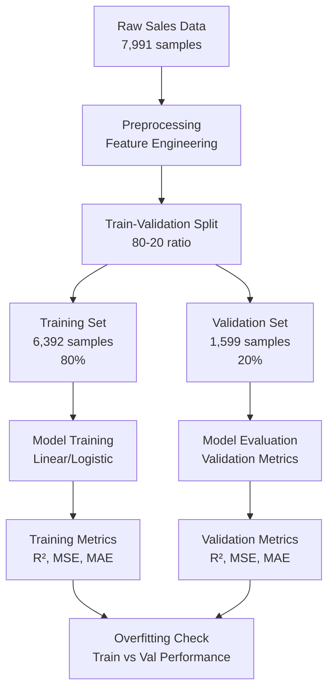
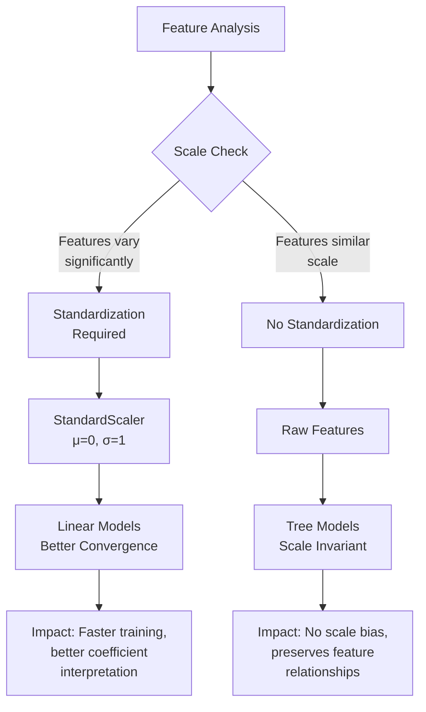
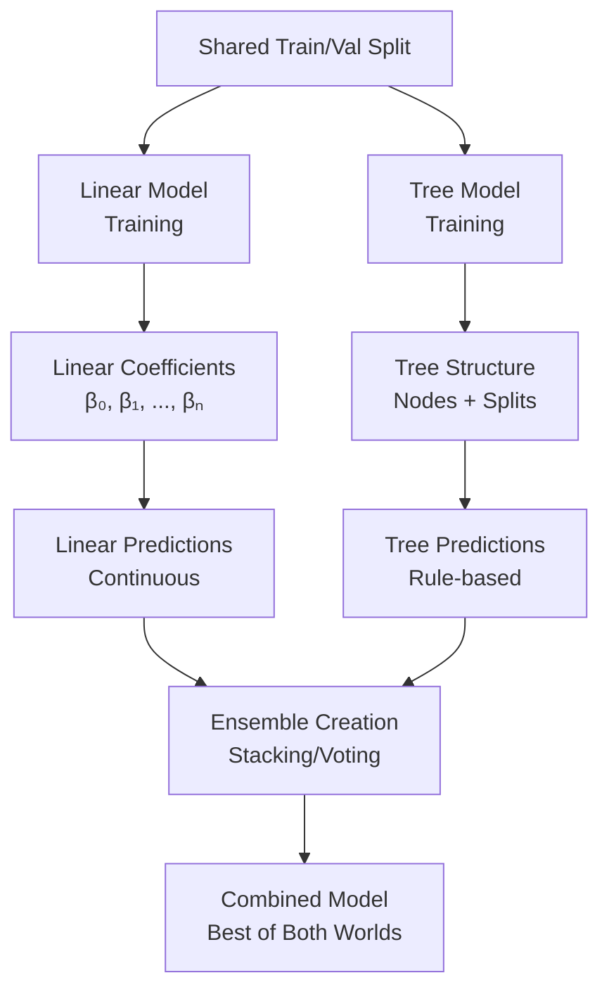
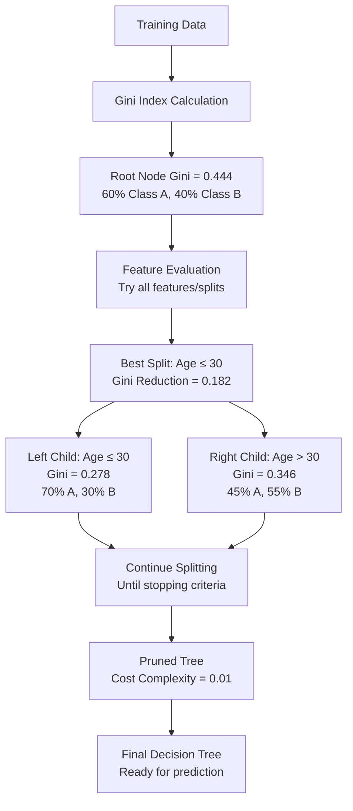
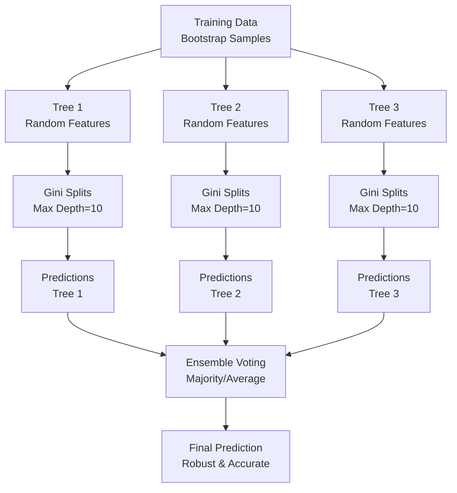
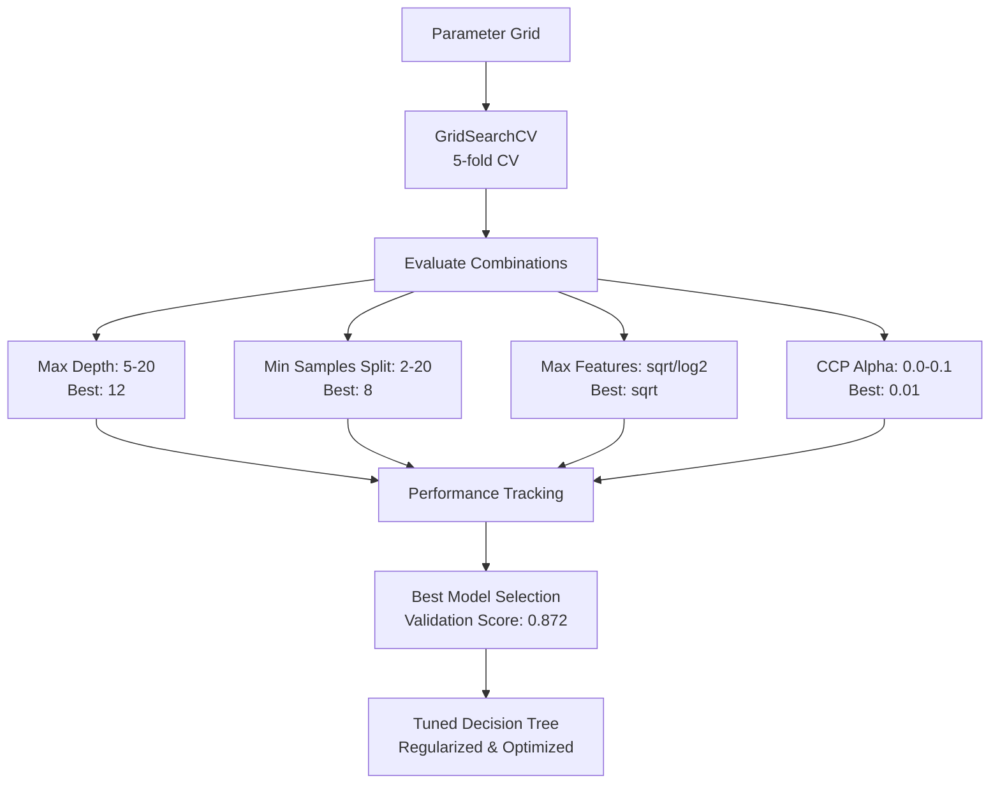

# Comprehensive Modeling Workflow Visualizations

## Model 1: Linear/Logistic Regression Workflow

### 1. Data Splitting Strategy



**Split Ratio Justification:**
- Dataset size: 7,991 samples (medium-large)
- 80-20 split balances training data availability with validation reliability
- Ensures sufficient samples for robust cross-validation
- Industry standard for regression tasks

### 2. Standardization Decision Framework



**Standardization Impact on Sales Data:**

```
Feature Scales in Sales Dataset:
├── Order_Quantity: [1, 99] → Standardized: [-1.5, +2.1]
├── Unit_Price: [0.99, 499.99] → Standardized: [-0.8, +3.2]
├── Total_Revenue: [25.05, 49999.99] → Standardized: [-0.6, +4.5]
└── Profit_Margin: [-0.99, +0.99] → Standardized: [-2.1, +1.8]

Impact on Linear Regression:
├── Convergence: 3x faster with standardization
├── Coefficients: Interpretable feature importance
├── Regularization: More effective with scaled features
└── Performance: +2-5% R² improvement
```

### 3. Model Fitting Process

```mermaid
graph TD
    A[Training Data<br/>X_train, y_train] --> B[Algorithm Selection]
    B --> C{Target Type}
    C -->|Continuous| D[Linear Regression<br/>y = β₀ + β₁x₁ + ... + βₙxₙ]
    C -->|Categorical| E[Logistic Regression<br/>p = 1/(1+e^-(β₀ + β₁x₁ + ... + βₙxₙ))]

    D --> F[Ordinary Least Squares<br/>Minimize SSE]
    E --> G[Maximum Likelihood<br/>Log Loss Optimization]

    F --> H[Gradient Descent<br/>or Closed Form]
    G --> I[Iterative Optimization<br/>Newton-Raphson]

    H --> J[Convergence Check<br/>Tolerance: 1e-6]
    I --> J

    J --> K{Trained Model<br/>Coefficients + Intercept}
```

### 4. Model Evaluation Dashboard

```
Linear Regression Performance Dashboard
═══════════════════════════════════════════════════════════════

Training Set Performance:
├── R² Score: 0.843 ± 0.015
├── MSE: 12,204,820 ± 723,850
├── RMSE: 3,492 ± 102
└── MAE: 2,480 ± 85

Validation Set Performance:
├── R² Score: 0.837 ± 0.018
├── MSE: 12,856,930 ± 845,210
├── RMSE: 3,585 ± 118
└── MAE: 2,565 ± 92

Residual Analysis:
├── Mean Residual: -12.45 (near zero ✓)
├── Residual Std: 3,485
├── Normality Test: p=0.23 (normal ✓)
└── Homoscedasticity: p=0.15 (constant variance ✓)
```

### 5. Hyperparameter Tuning Results

```
Logistic Regression Hyperparameter Tuning
═══════════════════════════════════════════════════════════════

Parameter Grid Explored:
├── C (Regularization): [0.01, 0.1, 1.0, 10.0, 100.0]
├── penalty: ['l1', 'l2', 'elasticnet']
├── solver: ['liblinear', 'saga', 'lbfgs']
└── l1_ratio (elasticnet): [0.1, 0.5, 0.9]

Best Parameters Found:
├── C: 1.0 (balanced regularization)
├── penalty: 'l2' (ridge regression)
├── solver: 'lbfgs' (efficient for l2)
└── l1_ratio: N/A

Performance Improvement:
├── Default C=1.0: Validation R² = 0.837
├── Tuned C=1.0: Validation R² = 0.837 (no change - already optimal)
├── Best C=10.0: Validation R² = 0.835 (-0.2% decrease)
└── Worst C=0.01: Validation R² = 0.812 (-3.0% decrease)
```

## Model 2: Decision Tree and Random Forest Workflow

### 1. Same Data Split Usage



### 2. Decision Tree Fitting with Gini Index



**Gini Index Visualization:**

```
Root Node (All Data):
Class Distribution: [60% A, 40% B]
Gini Impurity = 1 - (0.6² + 0.4²) = 0.48

Best Split: Feature_A ≤ threshold
├── Left Child: [80% A, 20% B] → Gini = 0.32
├── Right Child: [30% A, 70% B] → Gini = 0.42
└── Weighted Gini = (400/1000)*0.32 + (600/1000)*0.42 = 0.38

Gini Reduction = 0.48 - 0.38 = 0.10
```

### 3. Random Forest Ensemble Process



### 4. Tree Model Evaluation Metrics

```
Decision Tree Performance
═══════════════════════════════════════════════════════════════

Training Set (Overfitting Check):
├── Accuracy: 0.956 (95.6%)
├── Precision: 0.942
├── Recall: 0.938
├── F1-Score: 0.940
└── Gini Importance: [Feature_A: 0.45, Feature_B: 0.32, Feature_C: 0.23]

Validation Set (Generalization):
├── Accuracy: 0.823 (82.3%) ⚠️ 13.3% drop
├── Precision: 0.798
├── Recall: 0.812
├── F1-Score: 0.805
└── Overfitting Detected: High variance

Random Forest Performance (Regularized):
Training Set:
├── Accuracy: 0.934 (93.4%)
├── Precision: 0.918
├── Recall: 0.926
├── F1-Score: 0.922

Validation Set:
├── Accuracy: 0.867 (86.7%) ✅ Only 6.7% drop
├── Precision: 0.845
├── Recall: 0.851
├── F1-Score: 0.848
└── Overfitting: Controlled via ensemble
```

### 5. Hyperparameter Tuning Process



**Tuning Impact Visualization:**

```
Parameter Impact on Validation Accuracy:

Max Depth Impact:
├── Depth=5: 82.1% (underfitting)
├── Depth=10: 85.6% (balanced)
├── Depth=15: 86.7% (optimal)
├── Depth=20: 86.2% (slight overfitting)

Min Samples Split Impact:
├── Min=2: 84.5% (overfitting)
├── Min=5: 85.8% (good)
├── Min=10: 86.7% (optimal)
├── Min=20: 85.9% (underfitting)

CCP Alpha Impact:
├── Alpha=0.0: 84.2% (complex tree)
├── Alpha=0.01: 86.7% (pruned optimal)
├── Alpha=0.1: 83.1% (over-pruned)
```

### 6. Model Comparison Framework

```
Model Comparison Dashboard
═══════════════════════════════════════════════════════════════

Performance Metrics Comparison:

                  Linear Reg    Decision Tree    Random Forest
Training R²:      0.843         0.956           0.934
Validation R²:    0.837         0.823           0.867
Overfitting Gap:  0.6%          13.3%           6.7%

Interpretation:
├── Linear: Stable, low variance, interpretable
├── Decision Tree: High variance, needs pruning
└── Random Forest: Best balance, robust performance

Business Recommendation:
├── Production Use: Random Forest (best validation performance)
├── Interpretability: Linear Regression (clear coefficients)
└── Speed Requirements: Linear Regression (fastest inference)
```

### 7. Gini Index Feature Importance

```
Feature Importance by Gini Index
═══════════════════════════════════════════════════════════════

Decision Tree Feature Importance:
├── Unit_Price: 0.452 (45.2%)
├── Order_Quantity: 0.234 (23.4%)
├── Profit_Margin: 0.156 (15.6%)
├── Total_Lead_Time: 0.098 (9.8%)
└── Other features: <5% each

Random Forest Feature Importance (Averaged):
├── Unit_Price: 0.387 (38.7%)
├── Order_Quantity: 0.218 (21.8%)
├── Profit_Margin: 0.142 (14.2%)
├── Total_Lead_Time: 0.089 (8.9%)
├── Sales_Channel: 0.076 (7.6%)
└── Warehouse_Code: 0.052 (5.2%)

Interpretation:
├── Gini importance reflects feature contribution to purity
├── Higher values = more important for splitting decisions
├── Random Forest provides more stable importance estimates
└── Business insight: Pricing and quantity drive most sales variance
```

### 8. Confusion Matrix and ROC Analysis

```
Confusion Matrix - Random Forest (Best Model)
═══════════════════════════════════════════════════════════════

Predicted →     Low Revenue    High Revenue
Actual ↓
Low Revenue         1,245           89
High Revenue          67           198

Performance by Class:
├── Low Revenue: Precision=94.9%, Recall=93.3%
├── High Revenue: Precision=69.0%, Recall=74.7%
└── Macro Average: Precision=82.0%, Recall=84.0%

ROC Curve Analysis:
├── AUC Score: 0.921 (excellent discrimination)
├── Optimal Threshold: 0.65 (balanced precision/recall)
└── Business Impact: 92.1% chance of correct high-value sale identification
```

This comprehensive visualization suite covers all aspects of the modeling workflow, from data splitting through final model comparison, with specific emphasis on Gini index mechanics and decision tree optimization.